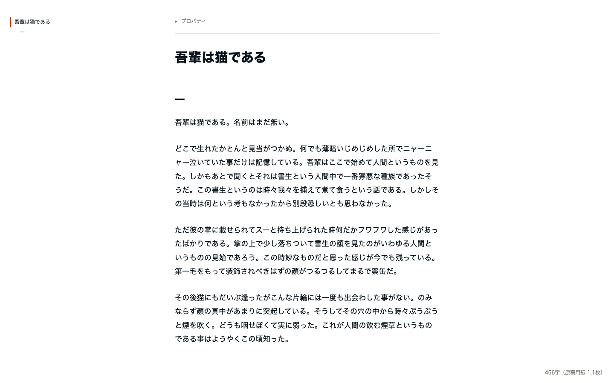

# kaku

Markdown を、Cursor / VS Code の中で紙のような画面で執筆するための WYSIWYG エディタ拡張です。装飾を削ぎ落としたフラットな白い紙面と、選択時にだけ浮かぶバブルツールバーで、日本語のブログ・書籍の執筆に集中できます。frontmatter・チェックボックス・テーブル・コードフェンス、さらに wikilink `[[...]]` などの記法を壊さずに往復できることを最優先に設計しています。



## インストール（ローカル vsix 配布）

```bash
npm install
npm run build
npx @vscode/vsce package   # kaku-x.y.z.vsix を生成
```

生成された `.vsix` を Cursor / VS Code へ導入します（コマンドパレット → "Extensions: Install from VSIX..." で `.vsix` を選択）。

更新時は `package.json` の version を上げてから package してください（同一バージョンの上書きインストールは新旧ファイル混在の原因になります）。

## 使い方

1. `.md` ファイルを開く（通常のテキストエディタが既定のまま。kaku は既定エディタを奪いません）。
2. コマンドパレットで **「kaku: 執筆モードで開く」** を実行すると、現在の `.md` が kaku エディタで再オープンされます。

ファイルを kaku で開いただけでは何も書き込みません。実際に本文を編集したときにだけ、frontmatter をバイト単位で保全したまま保存されます。Obsidian などの wikilink を使うツールと Vault / リポジトリを共有していても安全に使えます。

## 執筆を助ける機能

- **アウトライン**: 画面が十分広い（幅 960px 以上）とき、左端に見出し（h1〜h3）の一覧を表示します。クリックでその見出しへジャンプします。
- **スラッシュコマンド**: 空の行で `/` を入力するとブロック挿入メニューが開きます。↑↓ で選択、Enter で確定、Escape で解除。
- **＋ メニュー**: 空の行の左に出る「＋」からも同じブロックを挿入できます。
- **文字数**: 右下に「1,234字（原稿用紙 3.2枚）」を常時表示します。
- **コメント注釈**: テキストを選択してバブルメニューからコメントを付けられます。ハイライトのクリックで内容確認・解決、「コメント (n)」ボタンで一覧パネルを開閉。コメントは本文の Markdown には一切書き込まず、隣に置かれるサイドカーファイル `<ファイル名>.md.comments.json` に保存されます（本文編集後もアンカーが前後の文脈から位置を追従します）。サイドカーは「kaku: コメントファイルを開く」で確認できます。

## 設定

| 設定キー | 既定 | 説明 |
| --- | --- | --- |
| `kaku.typeface` | `gothic` | 本文の書体。`gothic`（ゴシック / Hiragino Sans 系）または `mincho`（明朝 / Hiragino Mincho 系）。 |
| `kaku.comments.contextChars` | `40` | コメントのアンカーとして保存する前後の文脈の文字数。 |

## 開発

```bash
npm run build       # esbuild で dist/extension.cjs と dist/webview.js を生成
npm run watch       # 変更監視ビルド
npm run typecheck   # tsc --noEmit（strict）
npm run test        # vitest（frontmatter 分割・アウトライン抽出・Markdown ラウンドトリップ）
```
